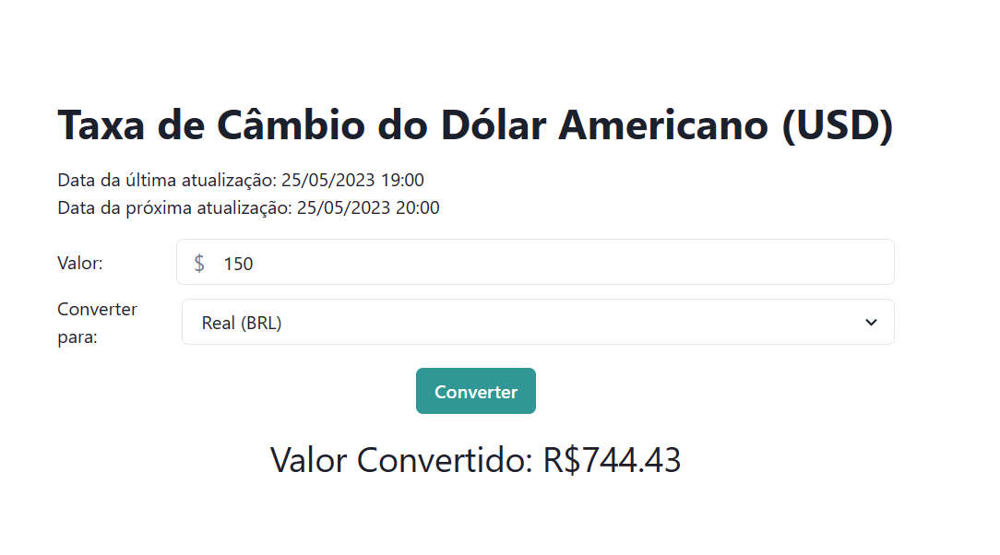
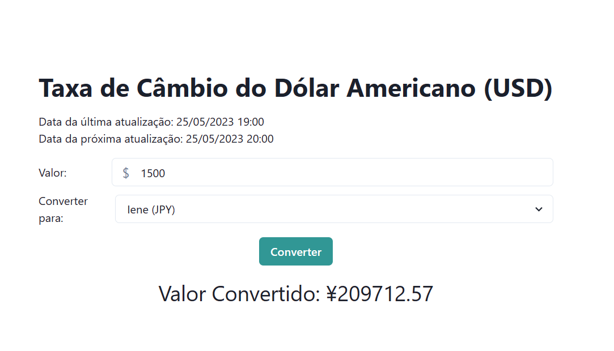

<h1 align="center"> <br> Taxa de Câmbio do Dólar Americano (USD) </h1>

## 📋 Descrição
Programa que consome a API externa do ExchangeRate-API e exibe as informações sobre as taxas de câmbio do dólar americano em relação a outras moedas. 

## 📷 Screenshots

### 1. Conversão de USD para BRL:
<p align="center">
   
</p>

### 2. Conversão de USD para EUR:
<p align="center">
   
</p>


### 3. Conversão de USD para JPY:
<p align="center">
   
</p>


## 👩🏽‍💻 Executando o app

  ### Pré-requisitos: 
  - Node.js: https://nodejs.org (versão 12 ou superior)
  - npm: Normalmente é instalado junto com o Node.js
  - Git: https://git.scm.com

  ### Configurando o ambiente 
  
  1. Clonar o repositório do aplicativo em React.js para sua máquina local usando o Git: 
     ```
      git clone https://github.com/seu-usuario/nome-do-repositorio.git
     ```
     
  2. Navegue até o diretório do projeto: 
     ```
      cd nome-do-repositorio
     ```

  3. Instale as dependências do projeto usando o npm: 
     ```
      npm install
     ```

   ### Executando o aplicativo
   Utilize o seguinte comando para executar o aplicativo:
     ```
        npm start
     ```
   

## 💻 Tecnologias Utilizadas

- React.Js
- Axios (Biblioteca JavaScript)
- Chakra UI
